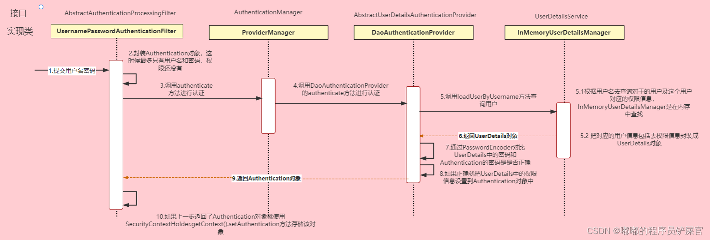

[toc]

# SpringSecurity 流程详解

## 图片

> 

## 流程

> 在每一次的请求中都会对呆着token的信息进行JWT验证，同时上下文中的认证信息只在一次请求周期内完成，下一次新的请求会进行新的认证。

## aurora项目`SpringSecurity`流程

### 参考

> [认证1流程](https://zhuanlan.zhihu.com/p/365513384)
>
> [SpringSecurity 登录流程](https://www.cnblogs.com/zongmin/p/13783174.html#_label1_0)
>
> [Spring Security详细讲解(JWT+SpringSecurity登入案例) 比较详细的一个流程](https://developer.aliyun.com/article/996569#slide-0)
>
> https://juejin.cn/column/6960549063062683684

### 前端设置token

> 代码：
>
> ```vue
> axios.interceptors.request.use((config) => {
>   config.headers['Authorization'] = 'Bearer ' + sessionStorage.getItem('token')
>   return config
> })
> ```
>
> 该函数是一个axios请求拦截器，用于在每次发送请求前统一设置请求头中的Authorization字段。它从sessionStorage中获取token，然后将其与'Bearer '拼接，作为Authorization字段的值。这样可以确保每个请求都携带了认证信息。

### 第一次认证的处理

> - 第一次都是登录，本地中并没有存在认证信息和token信息
>
> 	1. 前端发送登录请求，携带用户名和密码
>
> 	2. 因为`Security`配置开启了`formlogin()`，所以对于登录的请求，`UsernamePasswordAuthenticationFilter`会接收用户名和密码，进行封装为一个==待认证==的`Authentication`。
>
> 	  ```java
> 	  //UsernamePasswordAuthenticationFilter 类进行处理的语句
> 	  UsernamePasswordAuthenticationToken authRequest = new UsernamePasswordAuthenticationToken(username, password);
> 	  //封装之后就是对这个信息进行认证了
> 	  this.getAuthenticationManager().authenticate(authRequest);//通过这个方法进行认证
> 	  ```
>
> 	3. 通过调用`AuthenticationManager的authenticate()方法`进行上边`Authentication`的认证，认证成功，则会返回一个封装了当前用户权限等信息的 `Authentication` 对象进行返回。
> 	    但是因为`AuthenticationManager`是一个接口，`AuthenticationManager` 的默认实现是 `ProviderManager`，进而调用他的`authenticate()`方法进行认证处理。
> 	    但是它不直接自己处理认证请求，而是委托给其所配置的 `AuthenticationProvider` 列表，然后会依次使用每一个 `AuthenticationProvider` 进行认证，如果有一个 `AuthenticationProvider` 认证后的结果不为 `null`，则表示该 `AuthenticationProvider` 已经认证成功，之后的 `AuthenticationProvider` 将不再继续认证。然后直接以该 `AuthenticationProvider` 的认证结果作为 `ProviderManager` 的认证结果。如果所有的 `AuthenticationProvider` 的认证结果都为 `null`，则表示认证失败，将抛出一个 `ProviderNotFoundException`。
>
> 	  ```java
> 	  protected final UserDetails retrieveUser(String username, UsernamePasswordAuthenticationToken authentication)
> 	  //AuthenticationProvider 列表中一个实现类DaoAuthenticationProvider类中的一个认证执行方法 ,一般使用的就是这个进行认证。
> 	  //`AbstractUserDetailsAuthenticationProvider `是DaoAuthenticationProvider的上层抽象类，也就是ProviderManager--AuthenticationProvider：AbstractUserDetailsAuthenticationProvider（抽象类）---DaoAuthenticationProvider（抽象的实现类）
> 	  ```
>
> 
>
> 4. 而在委托的`ProviderManager`类中进行认证时【调用`authenticate()`或者`retrieveUser()`方法】，会使用`UserDetailsService`接口.
>     通过 `UserDetailsService` 的 `loadUserByUsername()` 方法获取用户名对应的信息并封装到 `UserDetails` 
>     ==本项目自定实现了`UserDetailsService`和`UserDetails`两个接口`UserDetailServiceImpl`和`UserDetailsDTO`，前者自定义了从数据库中取出`username`相关的数据==
>
>
> ```java
> UserDetails loadUserByUsername(String username)//通过用户名进行数据库的信息查找元素
> ```
>
> 5. `UserDetails` 赋给上层的`Provider`的实现类，之后调用`additionalAuthenticationChecks`方法对用户的密码进行最后的检查.方法是在`DaoAuthenticationProvider`父类 `AbstractUserDetailsAuthenticationProvider `的 `authenticate `方法中被调用的调用上下文中设置的`PasswordEncoder`，最终密码校验的细节完全在`BCrypt`实体类中进行
> 	补充：数据库保存的密码编码和这里的应设置一样，不一样要进行多次的编码解码，而数据库的设置，应该是在注册哪里进行保存的时候进行编码。
>
> 	```java
> 	//additionalAuthenticationChecks 方法内部执行验证的逻辑
> 	this.passwordEncoder.matches(presentedPassword, userDetails.getPassword())
> 	```
>
> 	==密码校验通过==之后就会返回一个认证通过的 `Authentication` 的 `principal`，然后会把该 `Authentication` 存入到 `SecurityContext` 中。
>
> 6. 现在认证处理已经完成，根据认证结果不同转向不同的处理器
>
> 	1. 认证成功，转向`AuthenticationSuccessHandler`
> 		1. 根据`SecurityContext` 中`authentication`信息，生成`JWT-token`。【具体实现细节在`TokenServiceImpl`中，他会生成，并把`authentication`对应的`UserDetails` 存入`redis`中】
> 		2. 将登录成功后的用户信息（包含token）返回给客户端（前端），==这里就保证后边请求会携带`token`了==
>
> 	1. 认证失败，转向`AuthenticationFailureHandler`,
> 		1. `aurora`项目这里就是向前端返回一个JSON字符串，包含了认证错误的原因。

### 已经经过登录的请求-不是登录请求

> 1. 前端发送请求【因为已经登录验证过了，这里请求中都会携带`token`】
>
> 2. 这里转向`JwtAuthenticationTokenFilter`进行验证，通过`doFilterInternal()`方法在这一次的上下文中设置`authentication`。
>     ==因为一个认证信息的周期就是一次请求的周期==
>
> 3.1. 如果可以通过解析`token`获取到对应的`UserDetails` ，说明这个用户是获得认证的用户，之后将其的`authentication`放到 `SecurityContext` 中。
> 3.2. 不能获取到，就会像登录那样直接转到`UsernamePasswordAuthenticationFilter`这个过滤器进行在一次的处理。【一般就是认证过期，再次登录】
>
> 4. 上下文存在`authentication`,这次请求的认证结束。剩余的过滤器等认证都会通过。
> 5. 执行具体的业务层逻辑。

### 权限认证

> [通过自定义决策管理器实现动态权限管理](https://blog.csdn.net/m0_59448100/article/details/127093942)
>
> [动态权限控制（上）思路](https://juejin.cn/post/6844904006209241096?searchId=2024031918550725963048FD0787BE7A2F#heading-0)
>
> [动态权限控制（下）实习](https://juejin.cn/post/6844904007534641159)

> 1. 用户认证之后，就要对请求`url`进行权限判定，判定当前认证的用户是否对于这个请求的资源有权限。
>
> 2. 而过滤器中的`FilterSecurityInterceptor`负责对 `http` 接口进行权限认证。【是Security的内置filter】
>
> 	```java
> 	 //`FilterSecurityInterceptor`	内执行的方法
> 	public void doFilter(ServletRequest request, ServletResponse response,
> 	 			FilterChain chain) throws IOException, ServletException {
> 	 		FilterInvocation fi = new FilterInvocation(request, response, chain);
> 	 		invoke(fi);
> 	 	}
> 	//初始化了一个 FilterInvocation ：封装 Servlet 环境中的 HTTP 请求、响应以及过滤器链 然后被 invoke 方法处理
> 	//实际上是将当前请求的上下文信息封装起来，并交给 Spring Security 的安全过滤器链进行处理。在过滤器链的执行过程中，各个安全过滤器可以通过 FilterInvocation 对象来获取当前请求的信息，并进行相应的安全控制操作。
> 	```
>
> 	`invoke`方法内部一般使用父类的 `beforeInvocation` 方法进一步进行鉴权处理，然后再进入过滤器链。
>
> 3. `beforeInvocation`方法详解
> 	通过 `this.obtainSecurityMetadataSource().getAttributes(Object object)`拿受保护对象（就是当前请求的 URI）所有的映射角色（`ConfigAttribute` 直接理解为角色的进一步抽象） ==也就是调用下边的元数据加载器的方法，得到方法生成的权限信息==。
>
> 	```java
> 	Authentication authenticated = this.authenticateIfRequired();
> 	//这一步拿到当前上下文的认证信息
> 	 this.accessDecisionManager.decide(authenticated, object, attributes);
> 	```
>
> 	然后使用访问自定义实现的决策管理器`AccessDecisionManager` 进行投票决策来确定是否放行。
>
> 4. `FilterInvocationSecurityMetadataSource`元数据加载器 
> 	加载符合这个`url`路径的权限列表（角色列表）
>
> 5. `AccessDecisionManager访问决策管理器`会将上边加载的角色列表和当前认证的角色信息对比，符合就放行，完成鉴权的认定。否则就抛出异常信息。
> 	【因为是自定义的，没有使用投票器，也就不需要投票判定，直接上述的角色对比，符合就放行】
>
> 6. 鉴权结束

### 异常处理

> 说明：
>
> 我们还希望在认证失败或者是授权失败的情况下也能和我们的接口一样返回相同结构的json，这样可以让前端能对响应进行统一的处理。要实现这个功能我们需要知道SpringSecurity的异常处理机制。在SpringSecurity中，如果我们==在认证或者授权的过程==中出现了异常会被`ExceptionTranslationFilter`捕获到。在ExceptionTranslationFilter中会去判断是认证失败还是授权失败出现的异常。

> 如果是==认证==过程中出现的异常会被封装成`AuthenticationException`然后调用 `AuthenticationEntryPoint` 对象的方法去进行异常处理。
> 如果是==授权==过程中出现的异常会被封装成`AccessDeniedException`然后调用 `AccessDeniedHandler` 对象的方法去进行异常处理。

> 所以如果我们需要自定义异常处理，我们只需要自定义`AuthenticationEntryPoint`和`AccessDeniedHandler`然后配置给`SpringSecurity`即可，
>
> 本项目认证实现类：`AuthenticationEntryPointImpl` 向前端发送JSON：用户未登录
>
> 本项目授权实现类：`AccessDeniedHandlerImpl`向前端发送JSON：用户权限不足

## 知识点

### `UserDetailsService`接口

> 1. 接口只提供了一个方法：
>
> 	```java
> 	UserDetails loadUserByUsername(String username) throws UsernameNotFoundException;
> 	```
>
> 	该方法很容易理解：==通过用户名来加载用户==。这个方法主要用于从系统数据中查询并加载具体的用户到Spring Security中。
>
> 2. UserDetailsService 可以知道最终交给Spring Security的是`UserDetails` 。
>
> 3. 通过继承``UserDetailsService`接口，可以自定义从数据库读取信息的逻辑。

### `UserDetails`接口

> 1. 该接口是提供用户信息的核心接口。该接口实现仅仅存储用户的信息。
>     后续会将该接口提供的用户信息封装到认证对象Authentication中去。
> 2. 我们可以自定义一些属性传递给`Authentication`,通过实现`UserDetails`接口。完成数据的自定义封装
> 3. ```java
> 		@Override
> 	    @Transient
> 	    public Collection<? extends GrantedAuthority> getAuthorities() {
> 	        return roles.stream()
> 	                .map(SimpleGrantedAuthority::new)
> 	                .collect(Collectors.toSet());
> 	    }
> 	```
>
> 	这个重写的方法同样可以用于`authentication.getAuthorities()`,本质就是使用这个获取`UserDetails`中`roles`信息（角色信息）。

### `UserDetailsManager`

> `UserDetailsManager` 类型负责对安全用户实体抽象`UserDetails`的增删查改操作。同时还继承了`UserDetailsService`接口。

### `PasswordEncoder`

> https://felord.blog.csdn.net/article/details/102504387

### `WebSecurityConfigurerAdapter`配置类

> https://felord.blog.csdn.net/article/details/102583995

### 自定义登录相关流程解析

> https://felord.blog.csdn.net/article/details/102617422

### 过滤器链

> https://mp.weixin.qq.com/s?__biz=MzUzMzQ2MDIyMA%3D%3D&chksm=faa2e6f2cdd56fe441d637ef6c339518af064bded807d6c12a0ac3ef9ed9424eb9785eae469f&idx=1&mid=2247484257&scene=21&sn=7034ccb9c2b6ac6d61364a2a87111a50#wechat_redirect

#### `SecurityContextPersistenceFilter`

> `SecurityContextPersistenceFilter` 主要控制 `SecurityContext` 的在一次请求中的生命周期 。请求来临时，创建`SecurityContext` 安全上下文信息，请求结束时清空 `SecurityContextHolder`。
>
> `SecurityContextPersistenceFilter` 通过 `HttpScurity#securityContext()` 及相关方法引入其配置对象 `SecurityContextConfigurer` 来进行配置。

### RBAC权限模型

> RBAC权限模型：**`基于角色的访问控制（RBAC）是实施面向企业安全策略的一种有效的访问控制方式。`** 其基本思想是，对系统操作的各种权限不是直接授予具体的用户，而是在用户集合与权限集合之间建立一个角色集合。每一种角色对应一组相应的权限。一旦用户被分配了适当的角色后，该用户就拥有此角色的所有操作权限。这样做的好处是，不必在每次创建用户时都进行分配权限的操作，只要分配用户相应的角色即可，而且角色的权限变更比用户的权限变更要少得多，这样将简化用户的权限管理，减少系统的开销。


