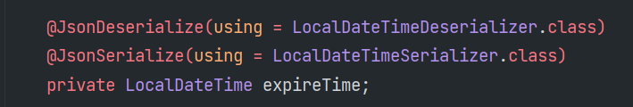
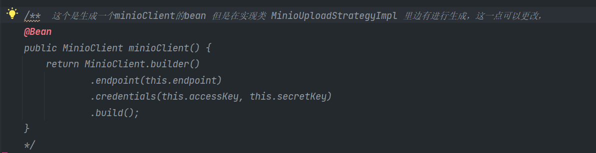

[toc]

# 代办

> - [x] 前台搜索框内的ES图标设置：svg/或者minio云端
> - [ ] bug:下线用户之后，前台缓存出错，不能够立刻清除，只能等到重新关闭页面之后，重新进才能更新
> - [x] java中某些属性的序列化的意思？
>   
> - [x] 本地部署取消OSS存储，使用本地图片的相关配置：minio 或者直接本地文件存储
> - [ ] 不使用qq互联登录 个人开发者认证未进行
> - [x] springboot+vue项目在本地上的部署连接
> - [ ] ==页面：鼠标点击特效==
> - [ ] 后端返回的权限不足，前端没有弹窗显示，只能再请求中的`response`中看到
> - [x] bug:前台，搜索功能不行
> - [ ] maxwell,相关部署未更改
> - [ ] 后台登录没有使用验证码（注册使用的邮箱作为验证码）。如果想，登录页面可以使用图片验证码：google的验证码工具类 
> - [x] 前端bug：jobLogs?`jobId=:quartzId`&current=1&size=10   中多了一个冒号，导致后端不能解析
> 
>  > url的初始化，是在数据库menu表中url，这个里边的参数呆着quartzId前呆着：，导致不能正常，主要是一般也不会这么直接查看
>   >
>   > 流程：
>   >
>   > 页面初始化会发送这个请求：`http://localhost:8001/api/admin/user/menus`，查询数据库中对应的菜单，然后把对应的初始化url数据传给对应VUE组件
>   >
>   > 但是后边不能通过在定时任务面版，==使用调度日志==来查看某个任务的具体日志，主要就不能发送对应的url。就是没请求发出来
> 
>- [x] bug:后台 定时任务 下次执行时间 一直显示Invalid Date：后端返回 job的数据中 nextValidTime: null 列表查询传值的时候没有设置下一次的执行时间

# 后端

## 文件上传相关

> 